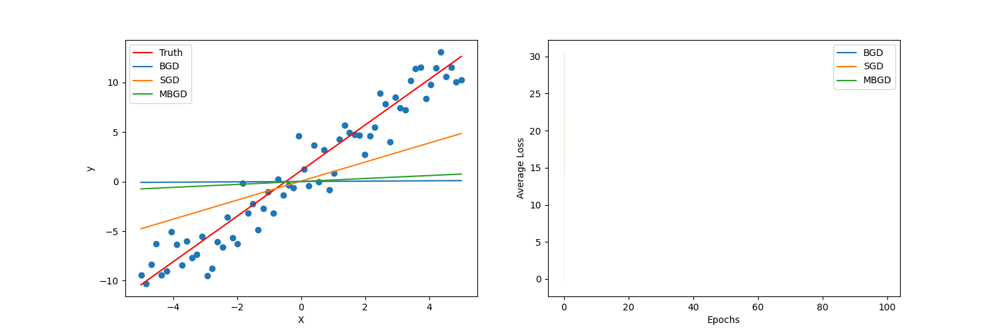

# Gradient Descent Variants Comparison

This repository contains a Jupyter notebook that compares different variants of gradient descent: Batch Gradient Descent (BGD), Stochastic Gradient Descent (SGD), and Mini-Batch Gradient Descent (MBGD). The objective is to offer a comprehensive understanding of the benefits and limitations of each method.



## Content

- **Comparative Analysis**: A side-by-side comparison of BGD, SGD, and MBGD, discussing their performance and suitability for different types of datasets and computational environments.
- **Code Implementation**: Implementation of each gradient descent variant with visualizations to demonstrate their convergence behavior.

## How to Use

1. Clone the Repository

    ```bash
    git clone https://github.com/marlonmoratti/gradient-descent-variants-comparison.git
    cd gradient-descent-variants-comparison

2. Install Dependencies
   ```bash
   pip install -r requirements.txt

3. Run the Notebook
    ```bash
    jupyter notebook gradient_descent_variants_comparison.ipynb

## Contact

If you have any questions or suggestions, feel free to open an issue or reach out to me directly.
